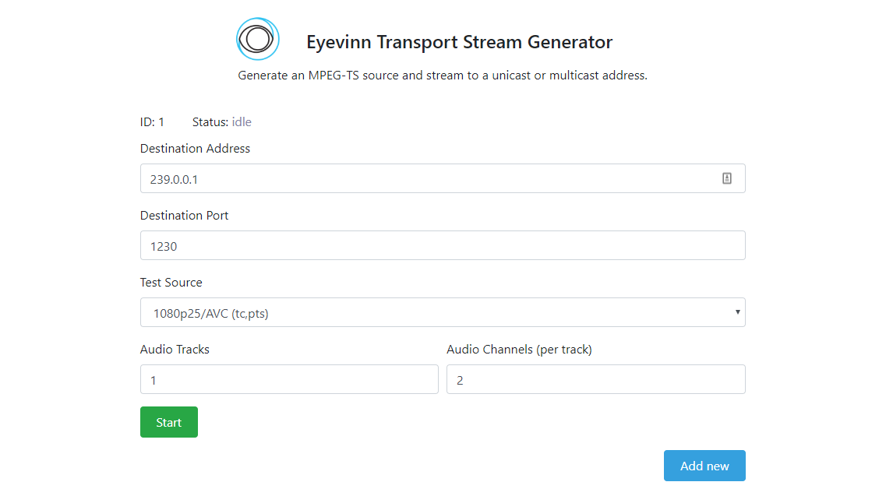

# Eyevinn Transport Stream Generator

The Eyevinn Transport Stream Generator is a containerized microservice based on `ffmpeg` that is used to generate an MPEG TS test stream. For example it can be used as a test source for a streaming video transcoder.

It provides a set of test streams with burned in timecode and current time in the video to make it possible to measure delay and latency. Number of audio streams in a stream can be specified and the number of audio channels in each audio stream.



## Installation

1. Install Docker Engine on your computer or server. Follow the instructions below to install Docker:

- Docker Desktop for Mac: https://docs.docker.com/docker-for-mac/install/
- Docker Desktop for Windows: https://docs.docker.com/docker-for-windows/install/
- Docker Engine CE for Linux (Ubuntu): https://docs.docker.com/install/linux/docker-ce/ubuntu/

2. Download the source and Dockerfile

The `$` denotes a command prompt and should not be typed in.

```
$ git clone git@github.com:Eyevinn/tsgen-svc.git
```

3. Build Docker image

```
$ cd tsgen-svc
$ docker build -t tsgen-svc:1 .
```

4. Run the Docker container

```
$ docker run --rm -d -p 3000:3000 tsgen-svc:1
```

5. Open a browser and go to `http://localhost:3000/web/` assuming that you installed this on your local machine. If not, replace localhost with the IP to the server where the container is running.

To start a test stream specify the following details in the user interface:

```
Destination Address: <IP address to where to push the stream>
Destination Port: <Port to receive on>
Test Source: <Choose one of the availabe types>
Audio Tracks: <Number of audio streams in the stream>
Audio Channels: <Number of channels per audio stream>
```

Then press the START button. Once state is `running` you can for example open VLC on the destination computer and play from `udp://@1230` and watch the stream.

If you want to try this out on your local machine and is running mac you need to specify `host.docker.internal` as the Destination Address.


## API Usage

A control API is provided and API docs (Swagger) available at `{{BaseURL}}/api/docs/`, for example `http://localhost:3000/api/docs/`. Below follow some examples of what can be done with the API.

### List available stream slots

```
$ curl -X GET "http://localhost:3000/api/v1/streams" -H "accept: application/json"
```

### Start a test stream on slot with ID 1

Generate an MPEG TS and start streaming to 192.168.1.40 and port 1230

```
$ curl -X PUT "http://localhost:3000/api/v1/streams/1" -H "accept: application/json" -H "Content-Type: application/json" -d "{\"id\":1,\"destAddress\":\"192.168.1.40\",\"destPort\":1230,\"audioStreams\":4,\"channels\":2,\"type\":\"testsrc720p25\",\"state\":\"starting\"}"
```

Open then for example VLC to receive on port 1230

### Stop a stream on slot with ID 1

```
$ curl -X PUT "http://localhost:3000/api/v1/streams/1" -H "accept: application/json" -H "Content-Type: application/json" -d "{\"id\":1,\"destAddress\":\"192.168.1.40\",\"destPort\":1230,\"audioStreams\":4,\"channels\":2,\"type\":\"testsrc720p25\",\"state\":\"stopping\"}"
```

## LICENSE

This software is open source and we welcome contributions.

[MIT License](https://github.com/Eyevinn/tsgen-svc/blob/master/LICENSE)

## Develop and Contribute

1. Fork and clone this repository

2. Build the image as above

3. Run the image in interactive mode and mount the source code directory to `/appdev` in the container.

```
$ docker run --rm -it -p 8000:3000 -v $PWD:/appdev tsgen-svc:1 /bin/bash
root@452789bff4ec:/app# cd /appdev
```

4. Start the backend in development mode (disabling CORS etc)

```
root@452789bff4ec:/appdev# DEBUG=* NODE_ENV=development node index.js
  tsgen-svc restify listening at http://[::]:3000
```

5. Run the frontend (based on React and Next.js) in development mode and point the frontend to use the backend on port `8000` as specified above.

```
$ NODE_ENV=development API_BASE_URL=http://localhost:8000/api/v1 npm run dev
```

Then the frontend is available on `http://localhost:3000/` and changes made to the frontend is rebuilt when a file is modifed. The frontend code is found in the folder `pages/` and the backend in `index.js`.

Contribute by submitting a pull request.

## About Eyevinn Technology

Eyevinn Technology is an independent consultant firm specialized in video and streaming. Independent in a way that we are not commercially tied to any platform or technology vendor.

At Eyevinn, every software developer consultant has a dedicated budget reserved for open source development and contribution to the open source community. This give us room for innovation, team building and personal competence development. And also gives us as a company a way to contribute back to the open source community.

Want to know more about Eyevinn and how it is to work here. Contact us at work@eyevinn.se!
